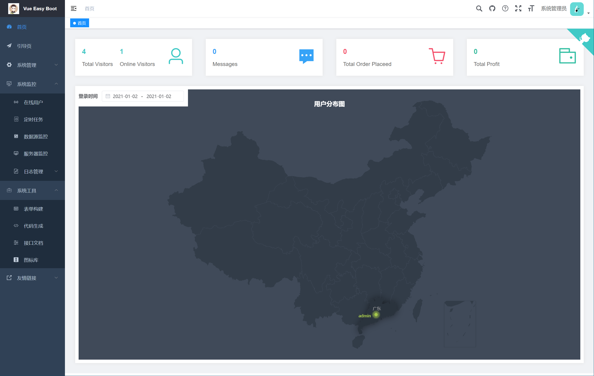
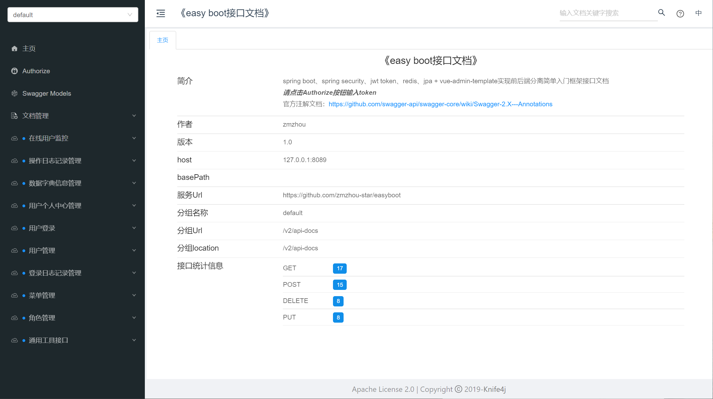
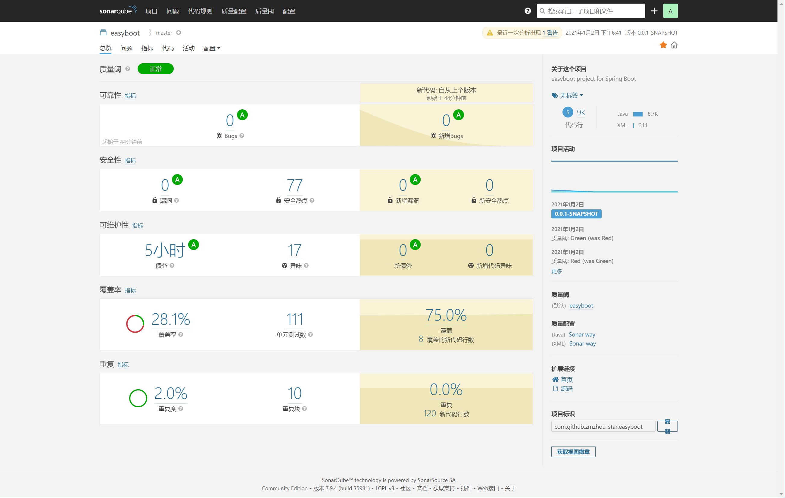

# easyboot

#### Description
spring boot、spring security、jwt token、redis、jpa + vue-admin-template A simple entry framework for separating front and back ends

#database document generation tool
`src\test\java\com\github\zmzhou\easyboot\DBGenerationTool.java`    
reference：[screw](https://gitee.com/leshalv/screw/tree/master/)

#sonar scan command
```bash
mvn clean org.jacoco:jacoco-maven-plugin:prepare-agent -Dmaven.test.failure.ignore=true install sonar:sonar -X
```
#### Software Architecture
Software architecture description

spring boot、spring security、jwt token、redis、jpa + vue-admin-template、flyway
#### system screenshot








#### Installation
1. `package`
```
mvn clean install -X -DskipTests
```
2. `run（Windows or Linux）`
```
java -jar -server easyboot-0.0.1-SNAPSHOT.jar
```
The current ssh window is locked, you can press CTRL + C to interrupt the program running, or directly close the window, the program exits.
3. `run（Linux daemon）`
```
nohup java -jar -server easyboot-0.0.1-SNAPSHOT.jar > easyboot.out 2>&1 &
```
nohup It means to run the command without hanging up, and the program will still run when the account is exited or the terminal is closed.
&represents running in the background


#### License
[The Apache-2.0 License](http://www.apache.org/licenses/LICENSE-2.0)

#### Instructions

1.  xxxx
2.  xxxx
3.  xxxx

#### Contribution

1.  Fork the repository
2.  Create Feat_xxx branch
3.  Commit your code
4.  Create Pull Request


#### Gitee Feature

1.  You can use Readme\_XXX.md to support different languages, such as Readme\_en.md, Readme\_zh.md
2.  Gitee blog [blog.gitee.com](https://blog.gitee.com)
3.  Explore open source project [https://gitee.com/explore](https://gitee.com/explore)
4.  The most valuable open source project [GVP](https://gitee.com/gvp)
5.  The manual of Gitee [https://gitee.com/help](https://gitee.com/help)
6.  The most popular members  [https://gitee.com/gitee-stars/](https://gitee.com/gitee-stars/)
